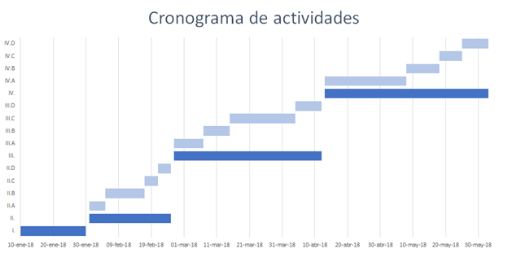

# PRECIO DE LA VIVIENDA EN COLOMBIA
## Aplicación de modelos predictivos a datos web
#### Camilo A Aguilar L

## Introducción

El objetivo central del presente proyecto consiste en predecir el precio de la vivienda en Colombia haciendo uso de diferentes modelos y técnicas computacionales enmarcadas en el Machine Learning. El suministro de información necesario para aplicar estas técnicas, resulta de la actual disponibilidad de consulta en decenas de aplicaciones web que ofrecen servicios centrados en brindar espacios adecuados en la red, para que cualquier persona o empresa pueda comprar o vender cualquier tipo de inmueble, presentando características específicas de cada uno, tales como la ciudad, el tipo de vivienda, barrio, estrato socioeconómico, número de habitaciones, entre muchas otras. 

### 1.1	Mercado de vivienda en Colombia

El mercado inmobiliario nacional ha tenido algunos cambios estructurales. Uno de los asuntos más importantes a considerar redunda en cómo las personas logran encontrar una vivienda que se ajuste a sus condiciones. La forma tradicional de obtener información al respecto resulta cuando las personas recorren de forma presencial lugares que resultan de su preferencia, esperando encontrar inmuebles ofertados en físico a través de avisos o pancartas publicitarias. Otra forma tradicional pero utilizada en menor frecuencia resulta de la publicidad en medios impresos (periódicos, revistas, volantes, etc), la cual podría ser más apropiada para aquellas personas que buscaban vivienda nueva.

Desde finales del siglo XX en Colombia, siguiendo las tendencias globales, se presentó el surgimiento del comercio electrónico, en particular el comercio enfocado en la compra, venta y arriendo de inmuebles a través de sistemas de información web, lo que representa un cambio casi que estructural a la forma como las personas buscan información sobre oferta comercial de finca raíz. En la actualidad, el comercio electrónico representa una herramienta muy utilizada en el país para realizar búsqueda de vivienda, aunque se encuentra limitado al acceso que tienen las personas a internet, y a la disponibilidad de información fuera de las grandes concentraciones poblacionales, por lo que las formas tradicionales siguen jugando un papel importante en estas búsquedas.

### 1.2	¿Qué buscan las personas?

Por otra parte, las situaciones básicas que definen las expectativas frente a las condiciones deseables para adquirir vivienda, giran en torno al presupuesto disponible y el centro urbano donde las personas o familias esperan ejecutar su proyecto de vida. Una vez definidas dichas condiciones de entrada, es evidente que la exigencia sobre de un inmueble estará centrada en lograr una maximización de características dotacionales definidas por condiciones propias de la(s) persona(s) que integran un grupo familiar; por ejemplo el número de integrantes definiría en gran medida el número de habitaciones a buscar y de ahí el área deseada y/o disponible según sea el caso, o la presencia de niños dentro del grupo, definiría la expectativa frente a disponibilidad de colegios o de zonas verdes. 

Podemos partir del hecho que los sistemas de información disponibles, contienen gran parte de esta información de forma explícita y otra información estaría de forma implícita o no de forma inmediata. La información explícita que en general se obtiene de la oferta a través del servicio web es:
 
* Tipo de vivienda
* Ubicación (Ciudad y barrio)
* Dirección
* Área
* Precio
* Número de habitaciones
* Número de baños
* Número de parqueaderos
* Valor de administración
* Antigüedad
* No. Piso
* Fotos del inmueble
* Estrato 

A la fecha, es posible encontrar información de este tipo dentro del territorio nacional en los siguientes portales:

* http://www.metrocuadrado.com
* https://www.fincaraiz.com.co/
* http://www.vivendo.co/
* https://www.goplaceit.com/co
* https://www.olx.com.co
* http://clasificados.eltiempo.com/secciones/vivienda/
* https://www.icasas.com.co/
* https://www.mitula.com.co/

De esta información disponible, es posible obtener características adicionales inherentes al inmueble, haciendo uso de diferentes técnicas o herramientas informáticas, así como de otros tipos de servicios de acceso público, como por ejemplo google maps y open street map (OSM). El uso de estos sistemas implicaría tener acceso a la siguiente información:
 
* Zonas verdes
* Número de tiendas
* Número de colegios
* Número de jardines infantiles
* Tipo de sector (comercial, residencial, rural, urbano, etc)
* Centros comerciales
* Vías de acceso 

Para la definición de zonas verdes, número de tiendas, colegios y jardines infantiles se tendrán en cuenta, todos aquellos ubicados en un diámetro de 500 metros alrededor del inmueble. Para el caso de centros comerciales, se definirá la distancia al centro comercial más próximo, y las vías de acceso y el tipo de sector a partir de información secundaria.

## 2.	Planteamiento del problema

### 2.1	Antecedentes

Si bien en Colombia, el Banco de la República realiza un seguimiento al precio de la vivienda, el cual se ve reflejado en los índices de precios para vivienda nueva y usada, dichos indicadores únicamente expresan una tendencia histórica, la estimación del valor de un inmueble específico no es posible bajo dichos indicadores.

Por otra parte, la información empleada para hacer todo tipo análisis respecto a los precios de los inmuebles, es obtenida de fuentes tradicionales las cuales incluyen variables aportadas por el sector financiero, quién dispone de información fiable y actualizada. La recolección de esta información supone una logística compleja que dificulta la extracción de comportamientos del mercado en tiempo real. 

Al respecto han surgido recientemente nuevas herramientas informáticas que permiten obtener información disponible en la web, que resultan de gran aplicabilidad, en particular para obtener datos relevantes que puedan ser usados en análisis sobre el mercado inmobiliario. En este punto, a nivel internacional se han desarrollado algunos proyectos relacionados con obtención de datos directamente de comercios electrónicos como los que se han mencionado anteriormente.

### 2.2	Obteniendo la información

Definida la ubicación de la información, la obtención de la misma plantea el primer problema por resolver y para esto resulta necesario definir cómo debe estructurarse la información y el flujo de la misma en el tiempo. Parte del propósito de este proyecto se ha planteado la necesidad de tener información en tiempo real (streaming), puesto que esto permitirá al modelo realizar los ajustes necesarios respecto a la dinámica propia del negocio inmobiliario. 

En este sentido, es necesario recurrir a técnicas computacionales que permitan estructurar la información de forma automática a la par de los cambios en los flujos de información de cada sitio web. Para el caso de la información de los diferentes portales de oferta de inmuebles, resulta apropiado el uso de una técnica conocida como web scraping, que consiste en diseñar un algoritmo que simule la navegación humana, con un enfoque en transformar lo datos sin estructura (como el formato HTML), en datos estructurados, de manera que puedan ser almacenados y analizados en una base de datos, en una hoja de cálculo o en cualquier otro sistema de almacenamiento.

Para el caso de la información implícita, se recurre a técnicas computacionales para el reconocimiento de imágenes, en particular técnicas de aprendizaje profundo, también se usará información de etiquetas disponibles en los servicios especializados en mapas como Google y/o OSM.

### 2.3	Modelando los datos

Una vez estructurados los datos y definidos los tiempos de acceso y actualización de la información, el objetivo se centrará en diseñar algunos algoritmos apoyados en diferentes técnicas estadísticas para lograr estimar el valor de un inmueble. Dicho algoritmo deberá ser capaz de determinar cuál técnica logra una mayor exactitud en la predicción a partir de un entrenamiento previo y del aprendizaje automático frente a la disposición de nueva información.

### 2.4	Justificación

De acuerdo con todo lo comentado hasta el momento,  resulta de gran valor definir una solución dinámica que logre hacer uso eficiente sobre la información actualmente disponible, además de representar una importante oportunidad para implementar técnicas innovadoras, que permitan obtener ventajas comerciales y/o económicas a la hora de comprar o vender inmuebles en el país.

## 3.	Objetivos

* Obtener información completa y relevante en la web frente al mercado del negocio inmobiliario en Colombia.
* Construir nuevas variables a partir de características del entorno de cada inmueble, a través de técnicas de aprendizaje profundo.
* Modelar el precio de la vivienda en Colombia, haciendo uso de diferentes técnicas de Machine Learning y Redes Neuronales.
* Encontrar las características que más influyen en el precio de un inmueble.
* Comparar los resultados de cada modelo para definir la técnica que mejor describe el precio de la vivienda en Colombia.

## 4.	Marco teórico

A continuación se presenta una lista de recomendaciones bibliográficas respecto a la teoría estadística y computacional que debe emplearse durante la ejecución del proyecto.

1.	Revisión de antecedentes sobre estimación de valor de inmuebles:
	a.	Hedonic model of house pricing based on customer analysis. (2014, 06). Proceedings of the 21st Annual European Real Estate Society Conference. 
	b.	Price, C. (2017). The Statistical Basis of Valuation: The Hedonic House Price Model. Landscape Economics, 223-248. 

2.	Revisión de teorías computacionales para la extracción de información no estructurada disponible en la web:
	a.	Mitchell, R. (2015). Web scraping with Python: Collecting data from the modern web. O'Reilly Media.
	b.	Scraping the Web. (2014, 12). Automated Data Collection with R,219-294

3.	Revisión de teoría de reconocimiento de imágenes:
	a.	Learning Object Detection Using Multiple Neural Networks. (2011). Proceedings of the International Conference on Computer Vision Theory and Applications. 
	b.	Matsugu, M., & Cardon, P. (2004). Unsupervised Feature Selection for Multi-class Object Detection Using Convolutional Neural Networks. Advances in Neural Networks – ISNN 2004 Lecture Notes in Computer Science, 864-869
	c.	Oruganti, R. M. (2016). Image description using deep neural networks. Rochester Institute of Technology.

4.	Revisión de teoría para aplicar al modelamiento de datos:
	a.	Generalized Linear Mixed Models (GLMMs). (2005, 01). Generalized, Linear, and Mixed Models Wiley Series in Probability and Statistics,220-246
	b.	Suthaharan, S. (2016). Random Forest Learning. Machine Learning Models and Algorithms for Big Data Classification Integrated Series in Information Systems, 273-288
	c.	Support Vector Machines for Regression. (n.d.). Support Vector Machines Information Science and Statistics, 330-351
	d.	Daniels, H., & Kamp, B. (1999, 08). Application of MLP Networks to Bond Rating and House Pricing. Neural Computing & Applications,8(3), 226-234. 

## 5.	Metodología

Para lograr los objetivos planteados, resulta necesario seguir la siguiente metodología, que plantea una estructura ordenada sobre los pasos y procedimientos a seguir:

* I.	Revisión de nueva literatura.

* II.	Obtención de información primaria
	* A.	Seleccionar los portales de información web sobre los cuáles se extraerá la información. Contrastar contra sistemas de información de otros países.
	* B.	Diseñar los algoritmos computacionales suficientes para hacer web scraping sobre cada portal seleccionado.
	* C.	Diseñar y automatizar base de datos estándar y estructurada para consolidar información de todos los portales web.
	* D.	Diseñar algoritmos de control de calidad de la información generada

* III.	Obtención de información secundaria
	* A.	Identificar posibles características secundarias extraíbles de portales de mapas y similares.
	* B.	Seleccionar técnicas computacionales para la extracción de la información seleccionada.
	* C.	Diseñar los algoritmos computacionales suficientes para extraer la información haciendo uso de las técnicas seleccionadas.
	* D.	Consolidar la información auxiliar en una base de datos estructurada.

* IV.	Modelación
	* A.	Diseñar y aplicar algoritmos computacionales para aplicar diferentes técnicas estadísticas y de aprendizaje automático, para modelar el precio de los inmuebles a partir de la información seleccionada.
	* B.	Aplicar técnicas de comparación de modelos que permitan de forma automática seleccionar el modelo de mejor ajuste.
	* C.	Determinar características de mayor influencia en el precio de un inmueble.
	* D.	Diseñar estrategias para abstraer comportamientos ocultos en la dinámica de precios a través del tiempo.

## 6.	Cronograma y actividades

El siguiente cronograma contiene los tiempos de ejecución estimados para cada una de las tareas planteadas dentro de la metodología. Además, dichos tiempos tienen embebidos espacios de validación y retroalimentación frente a los resultados parciales obtenidos.

 
Las barras marcadas en color azul oscuro demarcan las tareas principales, y las de color azul clara señalan las subtareas contenidas dentro de cada una.

